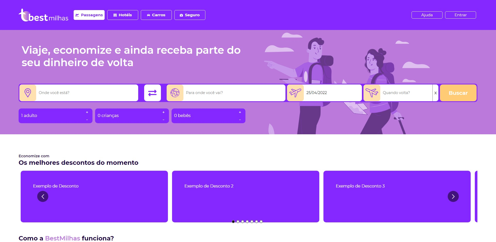

<h1 align="center">
 
  
 
 
SOMEC
</h1>

Sociedade de meio ambiente educação e cidadania em Belém, trabalha com edução e curso profissinalizante no interior do estado do Pará

  

    
 

## Tecnologia usada

Usado do php puro, no servidor linux 

- ⚛️ **Javascript** — colocar o player do wnoza
- ⚛️ **PHP** — PHP para servidor linux
- 💹 **JQuery** — Animações
- 💹 **MYSQL** — BD para conteudo

## Modelos

1. Todos os direito autoras pela Somec: 
3. Modelo apenas ilustratorio 

### Equipe de desenvolvimento

1. David orion (webdeveloper), Jairo Freitas (webdesigner)

